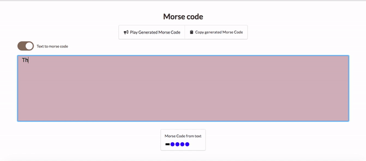

# MorseCode

Morse Code translator built on Javascript

* Takes in text as input and coverts to Morse and Vice versa
* Also plays the converted Morse Code

# Demo

[Demo Click here](https://harshattray.github.io/MorseCode/)

# How to run this

Clone the repo and run it on a local server
